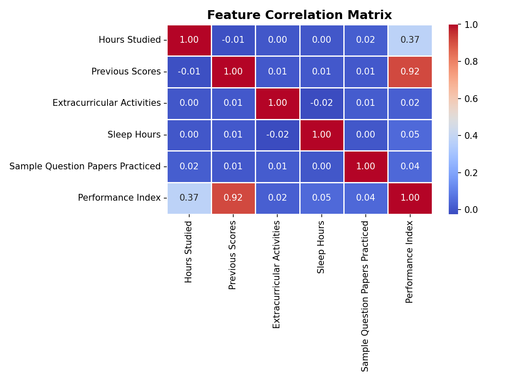
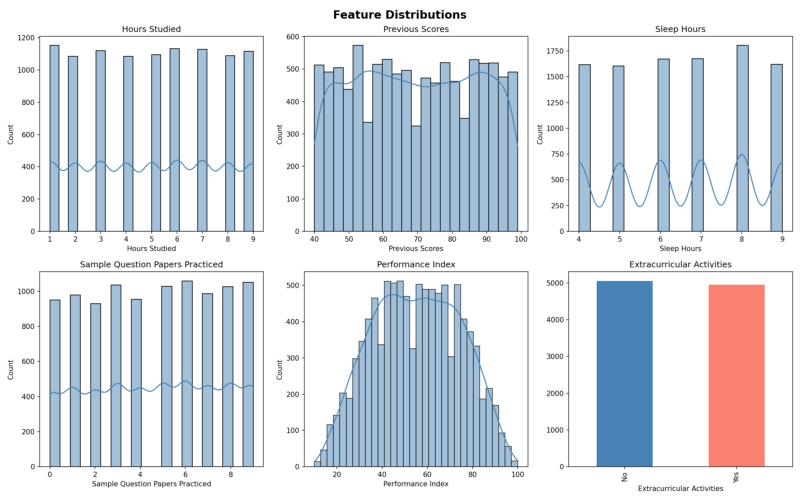
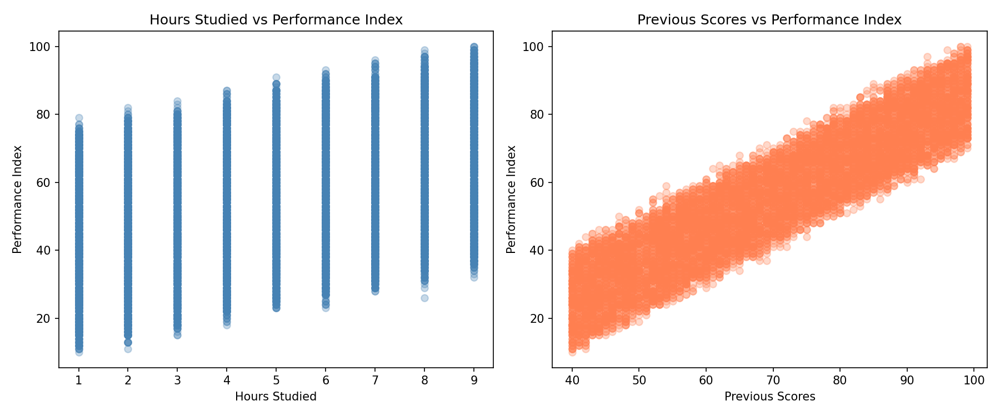

# Student Performance Predictor - Linear Regression Model

## Mission & Problem Statement
Students and educators lack a data-driven way to forecast academic outcomes early.
This project builds a Linear Regression model to predict a student's Performance Index
from study habits and lifestyle factors, enabling early identification of at-risk students
and targeted academic interventions.

## Dataset
- **Source:** [Kaggle - Student Performance Dataset](https://www.kaggle.com/datasets/nikhil7280/student-performance-multiple-linear-regression/data)
- **Size:** 10,000 rows × 6 columns (Hours Studied, Previous Scores, Extracurricular
  Activities, Sleep Hours, Sample Question Papers Practiced, Performance Index)

---

## Visualizations & Training Decisions

### Correlation Heatmap

Previous Scores (0.92) confirmed Linear Regression as the optimal model.
All features retained - none fell below the 0.01 correlation threshold.

### Feature Distributions

Uniform distributions with no skew - no log transformation needed.
No significant outliers detected via IQR - all 10,000 rows kept.

### Scatter Plots

Clear linear trend confirmed - standardization applied due to differing feature scales.

---

## Model Results

| Model | Test MSE | R² Score |
|---|---|---|
| **Linear Regression** | **4.0826** | **0.9890** |
| Random Forest | 5.1712 | 0.9860 |
| Decision Tree | 8.8959 | 0.9760 |

**Best model:** Linear Regression saved as `best_model.pkl`

---

## Prediction Demo
```python
Input : [7 hours studied, 85 previous score, extracurricular=Yes, 8h sleep, 3 papers]
Output: Predicted Performance Index → 54.71  |  Actual → 77.49
```